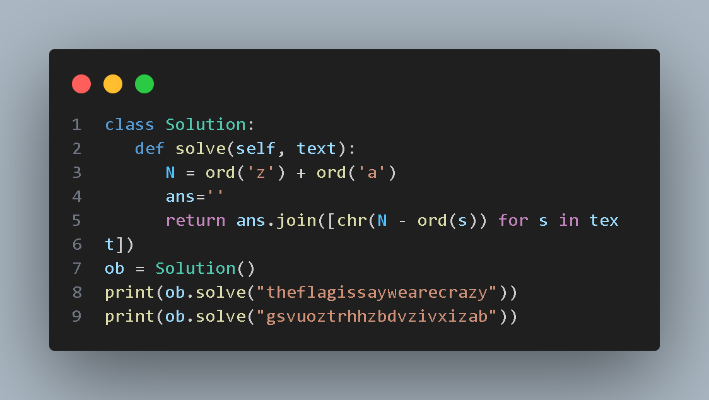
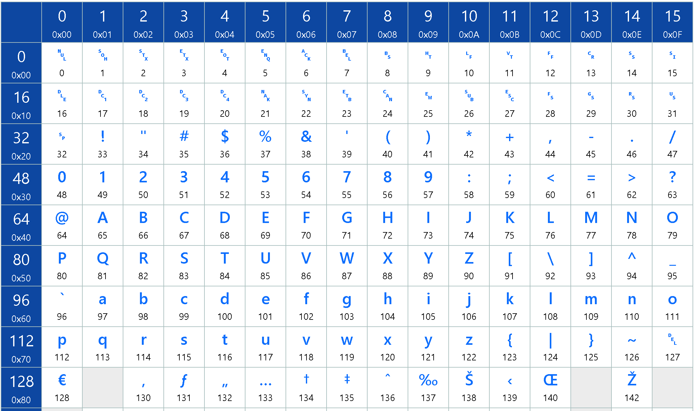

# MagicCrypto_Entrega

El enlace al repositorio es el siguiete: [GitHub](https://github.com/MiguelGG03/MagicCrypto_Entrega.git)

## Integrantes del grupo

Miguel Gonzalez y Nacho Pedrero

## Código del algoritmo Atbash

El código de resolución:

## Explicación

El código ASCII tiene ordenados los caracteres de todo tipo posible en en ordenador, donde encontramos diferentes intervalos como el de los caracteres latinos en mayuscula y minúscula. Aquí adjunto una imagen de la tabla del código ASCII.

Básicamente tenemos dos itervalos de tipos de letras, uno para las letras mayusculas y otro para las minúscilas. El funcionamiento del algoritmo Atbash es "invertir" las letras de su intervalo del abecedario.

$
Cifrado(letra) = (Z - letra) + A
$

- **letra** : es la letra que se va a cifrar
- **A y Z** : respresentan las posiciones numéricas de la primera y última letra del alfabeto respectivamente, en nuestro caso se hace usando los valores del código ASCII, que al ser en minúsculas son 97 para la 'a' y 122 para la 'z'.

Aplicando la fórmula escrita arriba, lo que logramos es "invertir" la letra de una manera simétrica en el alfabeto.
